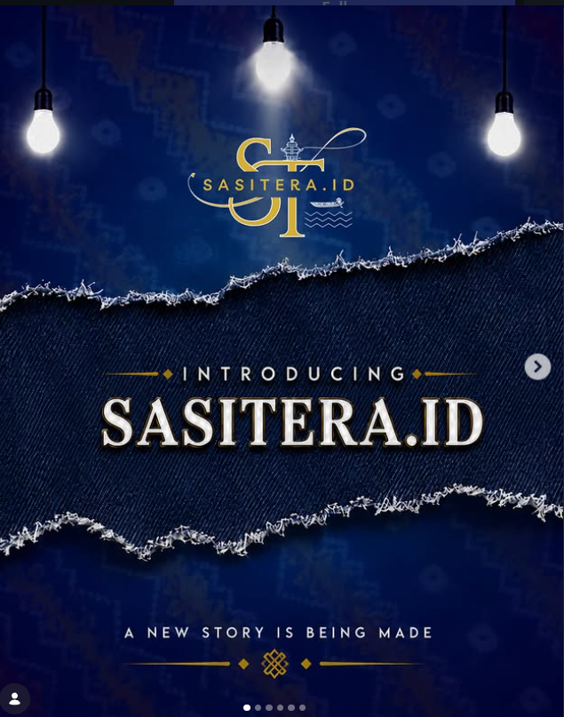

# ⚜️ SASITERA.ID — Preservasi Budaya Digital & Analisis Spasial IKM Sasirangan

<p align="center">
  
</p>

<p align="center">
  <b><i>A NEW STORY IS BEING MADE</i></b><br/>
  Karya Inovasi Lomba Analisis Data Statistik — <b>Banjarmasin Datathon 2026</b><br/>
  <i>Peringatan Hari Jadi Kota Banjarmasin ke-500 Tahun</i>
</p>

<p align="center">
  <a href="https://www.instagram.com/sasitera.id/"></a>
  
  
  
  
  
</p>

---

## 📌 Ringkasan Proyek
**SASITERA.ID** adalah platform web terpadu yang memadukan **Deep Learning Vision AI (CNN MobileNetV2)** untuk mengenali dan mengotentikasi motif tradisional kain Sasirangan khas Banjar secara instan, dengan **Sistem Informasi Geografis (GIS Leaflet.js)** pemodelan spasial mikro dari **249 industri tekstil & pengrajin kreatif** yang bersumber dari **Portal Satu Data Kota Banjarmasin**.

---

## 🌟 Fitur Utama

### 1. 🤖 AI Vision Classifier (Deep Learning CNN MobileNetV2)
- **Klasifikasi Otomatis 4 Motif Tradisional**: *Gelombang, Hiris Pudak, Kembang Kacang, Turun Dayang*.
- **Akurasi Validasi Model**: **87.8%** dengan inferensi real-time.
- **Ensiklopedi Filosofi Adat Banjar**: Menampilkan makna simbolik, palet warna khas Banjar, serta panduan teknik jahit jelujur.
- **1-Click Sample Testing & Image Drag-and-Drop**.

### 2. 🗺️ Geodashboard Spasial Interaktif (Leaflet.js)
- Pemetaan sebaran **249 titik industri tekstil & UMKM Sasirangan** di 5 kecamatan Kota Banjarmasin.
- Filter interaktif berdasarkan **Kecamatan** dan **Kategori KBLI** (Sasirangan/Batik vs Industri Pendukung).
- Informasi pop-up detail per industri: Nama Usaha, Pemilik, Alamat, Kelurahan, Kecamatan, dan Kode KBLI.

### 3. 📊 Analisis Statistik & Ekonometrika Sektoral
- Perhitungan **Location Quotient (LQ)** per kecamatan:
  - *Banjarmasin Tengah*: $\text{LQ} = 1.74$ (Sektor Basis Utama / Core Cluster)
  - *Banjarmasin Utara*: $\text{LQ} = 1.69$ (Sektor Basis Sekunder)
- Pemodelan konsentrasi aglomerasi: Top 2 Kelurahan (*Seberang Mesjid 55 IKM & Sungai Jingah 33 IKM*) menguasai **35.3%** seluruh ekosistem di Kota Banjarmasin.
- Kurva evaluasi model AI (*Training Accuracy/Loss Curves* & *Confusion Matrix*).

### 4. 🌓 Light Mode & Dark Mode
- Antarmuka responsif modern bergaya *Glassmorphism* dengan fitur pengalih tema instan (Mode Gelap: *Deep Royal Indigo*; Mode Terang: *Crisp Clean Slate*).
- Peta Leaflet yang berganti tema secara dinamis (*CartoDB DarkMatter* vs *CartoDB Voyager*).

---

## 🚀 Panduan Instalasi & Menjalankan

### Opsi 1: Menjalankan Secara Lokal (Python)
1. **Clone repository ini:**
   ```bash
   git clone https://github.com/USERNAME/NAMA-REPO.git
   cd NAMA-REPO
   ```
2. **Install dependensi:**
   ```bash
   pip install -r requirements.txt
   ```
3. **Jalankan server Flask:**
   ```bash
   python app.py
   ```
4. **Buka peramban di:** `http://127.0.0.1:5000`

---

### Opsi 2: Menjalankan Menggunakan Docker
```bash
docker compose up --build
```
Aplikasi akan langsung dapat diakses di `http://localhost:5000`.

---

## 📂 Struktur Direktori Proyek
```
.
├── app.py                                   # Backend Flask & REST API AI/GIS
├── Dockerfile                               # Konfigurasi Container Docker
├── docker-compose.yml                       # Orkestrasi Docker Compose
├── requirements.txt                         # Dependensi Proyek Python
├── train_model.py                           # Skrip Pelatihan CNN MobileNetV2
├── analyze_spatial_economic.py              # Analisis Statistik LQ & Spasial
├── scrape_lengkap.py                        # Web Scraper Satu Data Banjarmasin
├── data_industri_sasirangan_ekraf_lengkap.csv # Basis Data 249 Industri
├── data_industri_sasirangan_ekraf_lengkap.xlsx
├── models/
│   └── sasirangan_mobilenetv2.pth          # Bobot Model PyTorch (87.8% Akurasi)
├── templates/
│   └── index.html                           # UI Tailwind CSS + Leaflet + Chart.js
└── static/
    ├── img/                                 # Visual Branding & Grafik Ilmiah
    ├── samples/                             # Sampel Foto Uji Klasifikasi Motif
    └── uploads/                             # Direktori Unggahan Gambar
```

---

## 👥 Tim Penyusun
- **Ajang Lomba**: Banjarmasin Datathon 2026
- **Penyelenggara**: Dinas Komunikasi, Informatika dan Statistik Kota Banjarmasin
- **Instagram Resmi**: [@sasitera.id](https://www.instagram.com/sasitera.id/)
